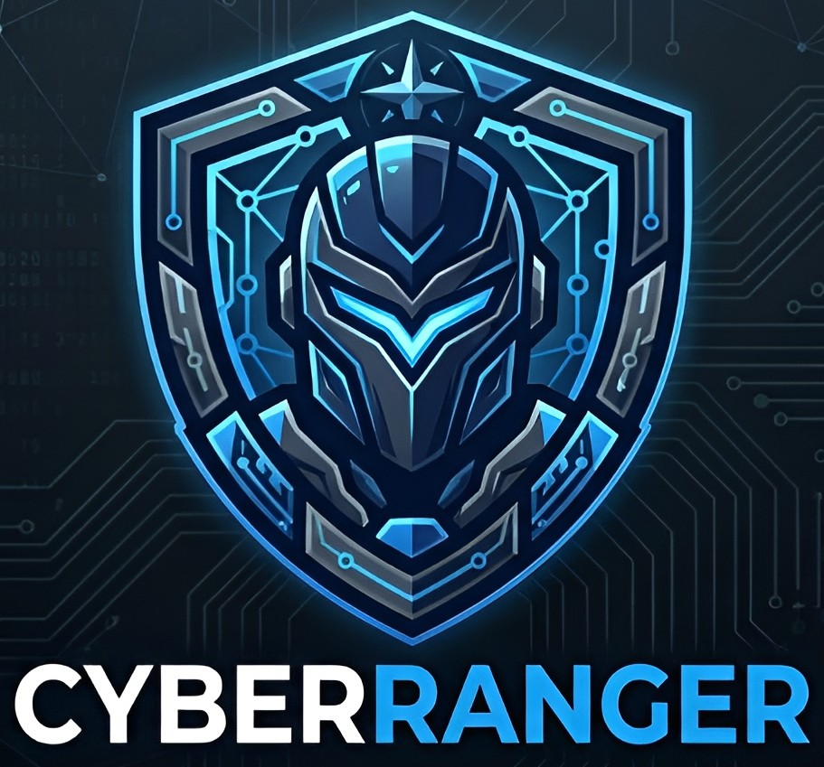

<p align="center">
   
</p>

# CyberRanger

A lightweight, No B.S., scalable Cyber Range platform using QEMU/KVM.

> **📚 [Complete Documentation Available in the Wiki](docs/wiki/Home.md)**

## Features
- **Backend**: Python FastAPI with Libvirt integration.
- **Frontend**: React + Vite with Tailwind CSS.
- **Console Access**: NoVNC integration for browser-based VM access.
- **Scenarios**: YAML-based scenario definition.

## Prerequisites
- Linux Host (Ubuntu/Debian recommended)
- Docker & Docker Compose
- KVM/QEMU installed on the host (`sudo apt install qemu-kvm libvirt-daemon-system libvirt-clients bridge-utils`)
- Current user in `libvirt` and `kvm` groups (`sudo usermod -aG libvirt,kvm $USER`)

### Dashboard


## VM Image Management

- Images are stored in `./images` on the host (bind-mounted to `/app/images
- Scenarios can reference images by name (e.g. `image: ubuntu-2204`) or define sources for auto-downloading.
## Topology Builder

- Drag-and-drop interface for designing network topologies.
- Define node configurations, connections, and automation steps.
- Supports multiple node types (e.g. servers, workstations, firewalls) with customizable resources.
- Automate interactions with VMs using scripted steps (e.g. send keystrokes, wait for output).
- Real-time console access via NoVNC for each node.

## Training System

- Create training courses with multiple scenarios.
- Each scenario can have its own topology, objectives, and difficulty level.
- Track learner progress and provide hints or solutions.
- Ideal for CTFs, workshops, or self-paced learning.

### Training Course Example


## Quick Start

1. **Clone the repository**
   ```bash
   git clone https://github.com/Slayingripper/CyberRanger
   cd CyberRanger
   ```

2. **Start the platform**
   ```bash
   docker compose up --build
   ```

3. **Access the Interface**
   Open your browser and navigate to:
   [http://localhost:5173](http://localhost:5173)

## Configuration
- **Scenarios**: Add new scenarios in the `scenarios/` directory.
- **Images**: Place images under `./images` (bind-mounted to `/app/images` in the backend). Scenarios can also auto-download images via `scenario.sources`.
- **Frontend API URL**: `VITE_API_URL` (default: `http://localhost:8001/api`).
- **Range Mapper**: set `RANGE_MAPPER_ENABLE=1` to allow scans.
- **Secure Image Downloads**: `scenario.sources` and `/api/images/download` now support optional `sha256`, `archive_sha256`, `min_bytes`, and `extract` metadata. HTTPS is required by default; set `CYBERANGE_ALLOW_HTTP_DOWNLOADS=1` only for trusted internal mirrors.
- **VM Credentials**: image-backed deployments now generate per-VM credentials by default instead of using the old shared `user/password` fallback. Override only if you intentionally want fixed credentials.
- **OpenWrt Auto-Download (optional)**:
   - `OPENWRT_IMAGE_URL` (e.g. OpenWrt x86_64 `*.img.gz`)
   - `OPENWRT_IMAGE_FILENAME` (download filename)
   - `OPENWRT_IMAGE_OUTPUT` (extracted image name, default `openwrt.img`)

### Scenario Source Example

```yaml
scenario:
   name: "Security Onion ISO Install"
   team: blue
   objective: "Boot and auto-drive the installer"
   difficulty: medium
   sources:
      security-onion:
         url: https://download.securityonion.net/file/securityonion/securityonion-2.4.150.iso
         filename: securityonion-2.4.150.iso
         sha256: <final-iso-sha256>
  
nodes:
   - id: so-1
      label: Security Onion
      config:
         image: security-onion
         cpu: 4
         ram: 8192
         assets: []
         automation:
            steps:
               - type: wait
                  delay_seconds: 60
               - type: send_text
                  text: "install\n"
               - type: send_key
                  key: enter
                  repeat: 1
```

The deploy-job endpoint publishes generated credentials and ISO automation progress in its job status payload, which makes unattended installs and follow-on configuration easier to monitor.

## Documentation

Comprehensive documentation is available in the [Wiki](docs/wiki/):

- **[📖 Wiki Home](docs/wiki/Home.md)** - Introduction and overview
- **[🚀 Installation & Setup](docs/wiki/Installation-and-Setup.md)** - Detailed installation guide
- **[📚 User Guide](docs/wiki/User-Guide.md)** - Complete user documentation
- **[🏗️ Architecture](docs/wiki/Architecture.md)** - Technical architecture details
- **[🔌 API Reference](docs/wiki/API-Reference.md)** - REST API documentation
- **[🎓 Training System](docs/wiki/Training-System.md)** - Creating training courses
- **[🌐 Topology Builder](docs/wiki/Topology-Builder.md)** - Network scenario design
- **[🔧 Troubleshooting](docs/wiki/Troubleshooting.md)** - Common issues and solutions
- **[🤝 Contributing](docs/wiki/Contributing.md)** - Contribution guidelines

## Troubleshooting
- **Permission Denied**: If the backend cannot connect to libvirt, ensure the socket permissions are correct or run docker-compose with `sudo`.
- **NoVNC**: Ensure ports 6080-6100 are available.
- **WebSocket Errors**: If you see “Unsupported upgrade request,” ensure the backend image was rebuilt after updating dependencies.

## TODO
- [ ] Add user authentication and role-based access control.
- [ ] Implement scenario sharing and export/import functionality.
- [ ] Fix clipboard sync issues in NoVNC.
- [ ] Allow custom network configurations (e.g. multiple interfaces, VLANs).
- [ ] Add llm-based scenario generation and hints via OLLAMA integration.
- [ ] Dynamic URL linking for ISO assets in scenario definitions.